# Assist

<div align="center">

**AI-powered tools for extending ERPNext with MCP (Model Context Protocol) integration**

[](https://opensource.org/licenses/MIT)
[](https://www.python.org/downloads/)
[](https://erpnext.com)

[Features](#features) • [Installation](#installation) • [Architecture](#architecture) • [API](#api-endpoints) • [Documentation](#documentation)

</div>

---

## 🎯 Overview

Assist is a comprehensive Frappe/ERPNext app that extends your ERP system with AI-powered automation, marketplace integrations, and Norwegian business tools. It bridges the gap between traditional ERP systems and modern AI capabilities through the Model Context Protocol (MCP).

### Key Capabilities

- 📸 **Smart Image Processing** - AI-powered background removal and enhancement for product photography
- 🧾 **Intelligent Receipt Scanning** - OCR and automatic item extraction from receipts
- 🏪 **Multi-Platform Marketplace** - Seamlessly post to Facebook Marketplace, FINN.no, leid.no
- 💰 **Price Intelligence** - Real-time price comparison across vendors and Prisjakt.no
- 🚚 **Smart Logistics** - Optimized pickup route planning for marketplace orders
- 🏢 **Norwegian Compliance** - Skatteetaten, Kommune, and NS 4102 accounting integration
- 📦 **Warehouse Discovery** - Automated warehouse finding on FINN.no
- 🤖 **AI Integration** - Full MCP server for AI model interaction
- 📝 **Technical Standards** - RDS 81346 and S1000D documentation generation
- 🔧 **DevOps Integration** - GitHub repository management as ERP assets

---

## 🏗️ Architecture

```mermaid
graph TB
    subgraph "External Services"
        AI[AI Models via MCP]
        Marketplaces[Marketplaces<br/>FB • FINN • leid.no]
        Norwegian[Norwegian Services<br/>Skatteetaten • Kommune]
        ImageAPI[Image APIs<br/>rembg • altlokalt]
        Prisjakt[Price Services<br/>Prisjakt.no]
    end

    subgraph "Assist App"
        direction TB
        API[API Layer<br/>assist/api.py]
        MCP[MCP Server<br/>mcp_server/server.py]
        Utils[Utilities<br/>Image Processing]
        Doctypes[Custom Doctypes<br/>Tool Drafts • Listings]
        
        API --> Utils
        API --> MCP
        MCP --> Utils
        MCP --> Doctypes
    end

    subgraph "ERPNext Core"
        Items[Items & Stock]
        Assets[Assets]
        Accounting[Accounting]
        Warehouse[Warehouses]
    end

    subgraph "User Interfaces"
        UI[ERPNext Desk UI]
        Mobile[Mobile/Camera]
        AIUI[AI Assistants]
    end

    UI --> API
    Mobile --> API
    AIUI --> MCP
    
    API --> Items
    API --> Assets
    API --> Accounting
    API --> Warehouse
    
    MCP --> AI
    API --> Marketplaces
    API --> Norwegian
    Utils --> ImageAPI
    API --> Prisjakt

    style Assist App fill:#e1f5ff
    style ERPNext Core fill:#fff4e6
    style External Services fill:#f3e5f5
    style User Interfaces fill:#e8f5e9
```



### Data Flow Example: Camera Item Addition


---

## ✨ Features

### 📸 Image Processing & OCR

- **AI Background Removal**
  - Local processing with rembg
  - Cloud API via altlokalt.com
  - Automatic fallback mechanism
  
- **Image Enhancement**
  - Brightness, contrast, sharpness adjustment
  - Batch processing support
  - Multiple format support (PNG, JPG, WebP)

- **Camera Stock Upload** ⭐ NEW!
  - Quick add items using phone camera
  - Batch upload for multiple items at once
  - Automatic background removal and enhancement
  - Intuitive mobile-first interface
  - Real-time processing status tracking

- **Receipt Scanning**
  - OCR text extraction
  - Automatic item detection
  - Line item parsing with prices

### 🏪 Marketplace Integration

**Supported Platforms:**
- Facebook Marketplace
- FINN.no (Norway's leading classifieds)
- leid.no (rental marketplace)
- bruktdel.no (used car parts) ⭐ NEW!
- Custom marketplace support

**Features:**
- Automated listing creation
- Image optimization
- Price suggestion
- Listing synchronization
- Phone-control automation
- **Car Parts Tracking** - Monitor bruktdel.no for new car parts linked to owned vehicle assets

### 🏢 Norwegian Business Tools

- **Accounting Standards**
  - NS 4102 (private sector)
  - DFØ standard (government)
  - Automatic chart of accounts import

- **Government Services**
  - Skatteetaten API integration
  - Employee registration
  - Tax report submission
  - Deadline monitoring

- **Municipal Services**
  - Building permit applications
  - Property upgrade requests
  - Renovation permits

### 🤖 MCP Server (AI Integration)

The MCP server exposes ERPNext operations to AI models:

**Built-in Tools:**
- Inventory queries (natural language)
- Item creation and management
- Receipt processing
- Price comparison
- Route optimization
- Marketplace posting

**Dynamic Tools:**
- Create custom tools via UI
- Non-programmer friendly
- Automatic registration
- Parameter validation

### 📝 Technical Documentation

- **RDS 81346** - Reference designation system
- **S1000D Issue 6** - Technical publication standard
- **GitHub Integration** - Repository as asset management

---

## 🚀 Installation

### Prerequisites

- Frappe/ERPNext v15+
- Python 3.10+
- bench CLI tool

### Quick Install

```bash
# Navigate to your bench directory
cd $PATH_TO_YOUR_BENCH

# Get the app
bench get-app https://github.com/minfuel/assist.git

# Install on your site
bench --site your-site-name install-app assist

# Install Python dependencies
cd apps/assist
pip install -r requirements.txt

# Restart services
bench restart
```

### Optional Dependencies

Install based on features you need:

```bash
# Image processing (background removal, enhancement)
pip install rembg pillow

# MCP server (AI integration)
pip install "mcp[cli]"

# OCR capabilities (receipt scanning)
pip install pytesseract

# All optional features
pip install -e ".[all]"
```

### Verifying Installation

```bash
# Check app is installed
bench --site your-site-name list-apps

# Run in console to test
bench --site your-site-name console
>>> import assist
>>> assist.__version__
'0.0.1'
```

---

## 🔄 Migration from Assist-v0

If you're upgrading from the old `erpnext_assist` app:

### Migration Steps

```bash
# 1. Backup your site (IMPORTANT!)
bench --site your-site-name backup --with-files

# 2. Uninstall old version
bench --site your-site-name uninstall-app erpnext_assist

# 3. Get new version
bench get-app https://github.com/minfuel/assist.git

# 4. Install new version
bench --site your-site-name install-app assist

# 5. Install dependencies
cd apps/assist
pip install -r requirements.txt

# 6. Restart services
bench restart
```

### What's Preserved

✅ All custom doctypes and their data  
✅ Marketplace listings  
✅ Tool drafts  
✅ Configuration settings  

### What Changed

- App name: `erpnext_assist` → `assist`
- Import paths updated
- Enhanced documentation
- Optional dependency structure

See [MIGRATION.md](MIGRATION.md) for detailed migration guide.

---

## 📚 API Endpoints

All endpoints are whitelisted and accessible via REST API.

### Image Processing

```python
# Remove background from image
POST /api/method/assist.api.remove_image_background
{
    "image_data": "base64_string",
    "enhance": true,
    "use_altlokalt_api": false
}

# Enhance image quality
POST /api/method/assist.api.enhance_image
{
    "image_data": "base64_string",
    "brightness": 1.1,
    "contrast": 1.1,
    "sharpness": 1.2
}
```

### Item Management

```python
# Quick add item with camera
POST /api/method/assist.api.quick_add_item
{
    "image_data": "base64_string",
    "warehouse": "Main Warehouse",
    "item_group": "Products",
    "valuation_rate": 100.00,
    "remove_background": true,
    "enhance_image_quality": true
}

# Scan receipt and add items
POST /api/method/assist.api.scan_receipt
{
    "receipt_image": "base64_string",
    "add_as": "stock",
    "warehouse": "Main Warehouse"
}
```

### Marketplace Operations

```python
# Compare prices across vendors
POST /api/method/assist.api.compare_prices
{
    "item_name": "Product Name",
    "search_prisjakt": true
}

# Plan pickup route
POST /api/method/assist.api.plan_pickup_route
{
    "listings": ["listing-1", "listing-2"],
    "start_location": "Oslo",
    "preferred_date": "2026-01-20"
}
```

### Norwegian Business

```python
# Import Norwegian chart of accounts
POST /api/method/assist.api.import_norwegian_accounts
{
    "standard": "NS4102",  # or "DFO"
    "company": "Your Company"
}

# Interact with Skatteetaten
POST /api/method/assist.api.interact_with_skatteetaten
{
    "action": "employee_registration",
    "data": "{...}"
}
```

See [assist/api.py](assist/api.py) for complete endpoint documentation.

---

## 🛠️ Configuration

### Hooks Configuration

Configure the app through ERPNext's hooks system in [hooks.py](assist/hooks.py):

```python
# Example: Add custom scheduled tasks
scheduler_events = {
    "daily": [
        "assist.tasks.sync_marketplace_listings"
    ]
}

# Example: Add custom API overrides
override_whitelisted_methods = {
    "frappe.desk.get_items": "assist.api.get_enhanced_items"
}
```

### App Settings

Configure via Desk → Setup → System Settings or create custom settings doctypes.

---

## 🧪 Development

### Setup Development Environment

```bash
# Clone and setup
cd ~/frappe-bench/apps
git clone https://github.com/minfuel/assist.git
cd assist

# Install pre-commit hooks
pre-commit install

# Install in development mode
pip install -e ".[all]"
```

### Code Quality Tools

Pre-commit runs these checks automatically:

- **ruff** - Fast Python linter and formatter
- **eslint** - JavaScript linting
- **prettier** - Code formatting
- **pyupgrade** - Python syntax modernization

### Running Tests

```bash
# Run all tests
bench --site your-site-name run-tests --app assist

# Run specific test
bench --site your-site-name run-tests --app assist --module assist.tests.test_api
```

### Running the MCP Server

```bash
# Development mode
cd apps/assist/assist/mcp_server
mcp dev server.py

# Production mode
mcp run server.py
```

### Project Structure

```
assist/
├── assist/              # Main app module
│   ├── api.py          # API endpoints (18 methods)
│   ├── hooks.py        # Frappe hooks configuration
│   ├── assist_tools/   # Custom doctypes
│   │   └── doctype/
│   │       ├── assist_tool_draft/
│   │       ├── marketplace_listing/
│   │       └── ...
│   ├── config/         # Desktop and module config
│   ├── mcp_server/     # MCP server implementation
│   ├── utils/          # Utility functions
│   │   └── image_processing.py
│   ├── public/         # Static assets
│   └── templates/      # Jinja templates
├── pyproject.toml      # Python package configuration
├── requirements.txt    # Python dependencies
└── README.md          # This file
```

---

## 📖 Documentation

- **[MIGRATION.md](MIGRATION.md)** - Detailed migration guide from v0
- **[BRUKTDEL_TRACKING.md](BRUKTDEL_TRACKING.md)** - Guide for tracking car parts on bruktdel.no
- **[API Documentation](assist/api.py)** - Complete API reference with examples
- **[Hooks Reference](assist/hooks.py)** - Available hooks and configuration

### Additional Resources

- [Frappe Framework Documentation](https://frappeframework.com/docs)
- [ERPNext Documentation](https://docs.erpnext.com)
- [Model Context Protocol](https://modelcontextprotocol.io)

---

## 🤝 Contributing

We welcome contributions! Here's how:

1. Fork the repository
2. Create a feature branch (`git checkout -b feature/amazing-feature`)
3. Make your changes
4. Run tests and linting (`pre-commit run --all-files`)
5. Commit your changes (`git commit -m 'Add amazing feature'`)
6. Push to the branch (`git push origin feature/amazing-feature`)
7. Open a Pull Request

### Coding Standards

- Follow PEP 8 for Python code
- Use type hints where applicable
- Write docstrings for all public methods
- Add tests for new features
- Update documentation as needed

---

## 📋 Roadmap

- [ ] Enhanced AI model integration
- [ ] Support for more marketplaces (eBay, Amazon)
- [ ] Advanced inventory forecasting
- [ ] Multi-language support
- [ ] Mobile app companion
- [ ] Real-time price tracking dashboard
- [ ] Automated vendor negotiations

---

## ⚠️ Known Issues

- Image processing requires significant memory for large images
- Some Norwegian services may require additional authentication
- MCP server needs separate port for AI model communication

---

## 🔒 Security

- Never commit API keys or credentials
- Use environment variables for sensitive data
- Follow ERPNext security best practices
- Regularly update dependencies

To report security vulnerabilities, email: kontakt@drivstoffapp.no

---

## 📄 License

MIT License - see [license.txt](license.txt) for details.

---

## 🙏 Credits & Acknowledgments

**Current Maintainer:** sm norge  
**Email:** kontakt@drivstoffapp.no  
**Repository:** https://github.com/minfuel/assist

**Original Author (v0):** samletnorge

**Built With:**
- [Frappe Framework](https://frappeframework.com)
- [ERPNext](https://erpnext.com)
- [Model Context Protocol](https://modelcontextprotocol.io)
- [rembg](https://github.com/danielgatis/rembg) - AI Background Removal
- [Pillow](https://python-pillow.org) - Image Processing

**Special Thanks:**
- The Frappe/ERPNext community
- Contributors to the MCP specification
- Norwegian business standards organizations

---

<div align="center">

**[⬆ back to top](#assist)**

Made with ❤️ in Norway 🇳🇴

</div>
